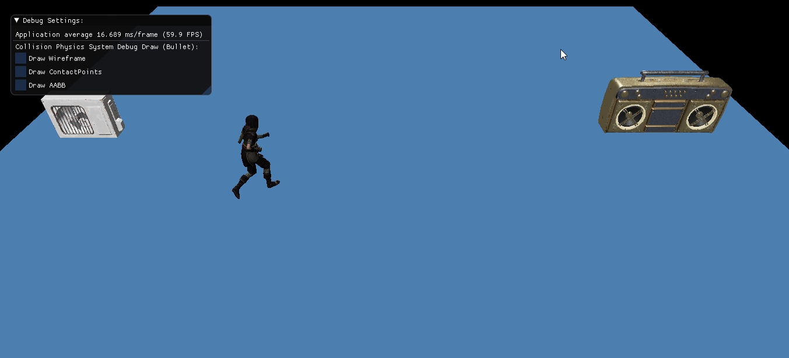

# MonaEngine
Motor desarrollado en C++ para el proceso de titulación en la carrera de Ingeniería en Computación de la Universidad de Chile.
## Documento de memoria
El documento escrito que describe en detalle el trabajo realizado en esta memoria esta en la carpeta Memoria.
## Dependencias
MonaEngine depende de una lista de diferentes librerías, estas estan en el directorio `thirdParty/`
 - [ImGui](https://github.com/ocornut/imgui) Para gui de depuración
 - [GLFW](https://www.glfw.org/) para la creación y manejo de ventanas e input.
 - [glad](https://glad.dav1d.de/) para cargar las funciones de OpenGL 
 - [glm](https://glm.g-truc.net/0.9.9/index.html) para algebra lineal.
 - [spdlog](https://github.com/gabime/spdlog) para Logging
 - [stb\_image](https://github.com/nothings/stb) para cargar imagenes desde disco
 - [dr_wav](https://mackron.github.io/dr_wav.html) para cargar archivos .wav desde disco
 - [assimp](https://github.com/assimp/assimp) para cargar mallas, animaciones y esqueletos.
 - [OpenAL-Soft](https://github.com/kcat/openal-soft) para la implementacion del sistema de audio.
 - [BulletPhysics](https://github.com/bulletphysics/bullet3) para la implementacion de sistema de fisica.
 
## Software/Libreria externas necesarias
Para generar el projecto,solución o makefiles se necesita [CMake 3.15+](https://cmake.org/), y de OpenGL4.5 para funcionar.

## Generando la solución o makefiles y el proceso de compilación
En windows basta con ejecutar el comando: **cmake -G "Visual Studio 16 2019" -A x64** , dentro del directorio del repositorio. Es importante
mencionar que la version de VS cambiara dependediendo de la version instalada en el computador donde se desea compilar el motor.

En linux basta ejecutar el comando **cmake . -DCMAKE_BUILD_TYPE=BUILDTYPE**, dentro del directorio del repositorio. BUILDTYPE puede ser
DEBUG o RELEASE.

Una vez generada la solición o los makefiles, basta con seguir el flujo tipico de VS o linux.
## Posibles problemas
El motor se desarrolló principalmente en windows y se probó en dos computadores con linux, en uno de estos fue necesario instalar
algunas librerías con los siguientes comandos:
 - sudo apt-get install xorg-dev libglu1-mesa-dev
 - sudo apt-get install libx11-dev

En uno de los computadores con linux en los que se probaron los ejemplos desarrollados fue necesario ejecutarlos con permisos de administrador
ya que OpenAL los necesita, de no hacerse se provocará un crash en medio de la ejecución de los ejemplos.

## Como crear aplicaciones usando el motor
La manera más automática, y quizás más sencilla de usar el motor dentro de un nuevo proyecto es usando CMake. Para esto un ejemplo 
de estructura de archivos y carpetas consistiría de los siguientes elementos:
 - Una carpeta de nombre MonaEngine que contiene los archivos del repositorio del motor.
 - Un archivo llamado CMakeLists.txt con contenido similar  al extracto de código mostrado más abajo.
 - El resto de los archivos fuentes y encabezados necesarios. En el caso del ejemplo ilustrado por el extracto de código mostrado más abajo 
 estos corresponden a main.cpp, clase0.h, clase0.cpp, clase1.h y clase.cpp.
 
El siguiente extracto de código muestra un ejemplo de CMakeLists.txt para un proyecto de nombre SomeGame, que consiste de dos clases, 
clase0 y clase1, y otro archivo de fuente con la definición del punto de entrada de ejecución.

```
set(CMAKE_LEGACY_CYGWIN_WIN32 OFF)
cmake_minimum_required(VERSION 3.15)
project(SomeGame C CXX)
add_subdirectory(MonaEngine)
add_executable(SomeGame main.cpp clase0.h clase0.cpp clase1.h clase1.cpp) 
set_property(TARGET SomeGame  PROPERTY CXX_STANDARD 20)
target_link_libraries(SomeGame  PRIVATE MonaEngine)
target_include_directories(SomeGame  PRIVATE  ${MONA_INCLUDE_DIRECTORY} ${THIRD_PARTY_INCLUDE_DIRECTORIES})
```
## Assets usados
Para la implementación de los ejemplos desarrollados con el motor se usaron los siguientes assets:
 - Animaciones, mallas y esqueletos desde el sitio https://www.mixamo.com/#/.
 - [Sonido de aire acondicionado](https://freesound.org/people/addiofbaddi/sounds/241702/) bajo la licencia CC0.
 - [Drumloops](https://freesound.org/people/Bronxio/sounds/199870/) bajo la licencia CC0.
 - [Golden Super Fly Boombox Roblox Remake](https://sketchfab.com/3d-models/golden-super-fly-boombox-roblox-remake-d2b9b14dd01e4fa0bdd3b1704fcb2b2f) hecho por el artista Sir_Numb y bajo la licencia CC.
 - [Drakefire Pistol](https://sketchfab.com/3d-models/drakefire-pistol-bee02e85f22d4eaaa3c0144f11204843) hecho por el/la artista [Teliri](https://www.artstation.com/artwork/3XE92) y bajo la licencia CC.
 - [Air Conditioner Low Poly](https://sketchfab.com/3d-models/air-conditioner-low-poly-textured-game-asset-84c4e55948414c6db2473da7b6e9cbb7) hecho por el artista [Karthik Naidu](instagram.com/k3dart) y bajo la licencia CC.

 
## Screenshots

